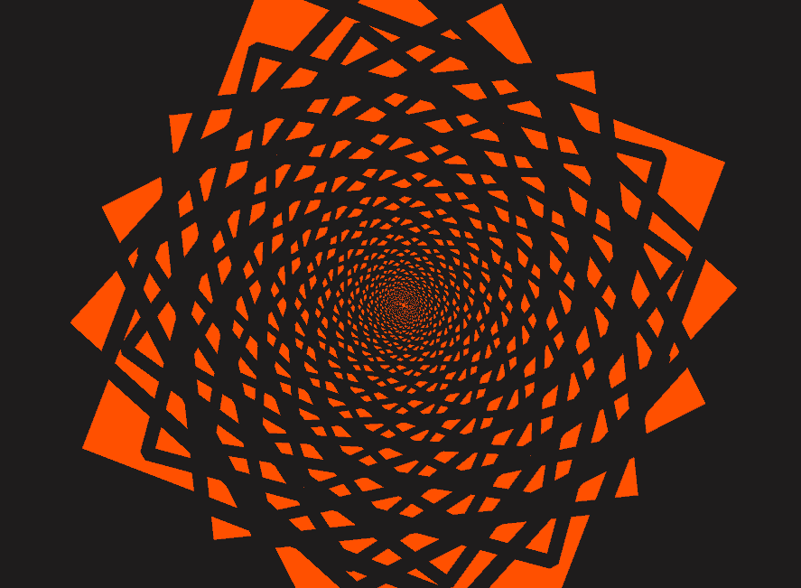
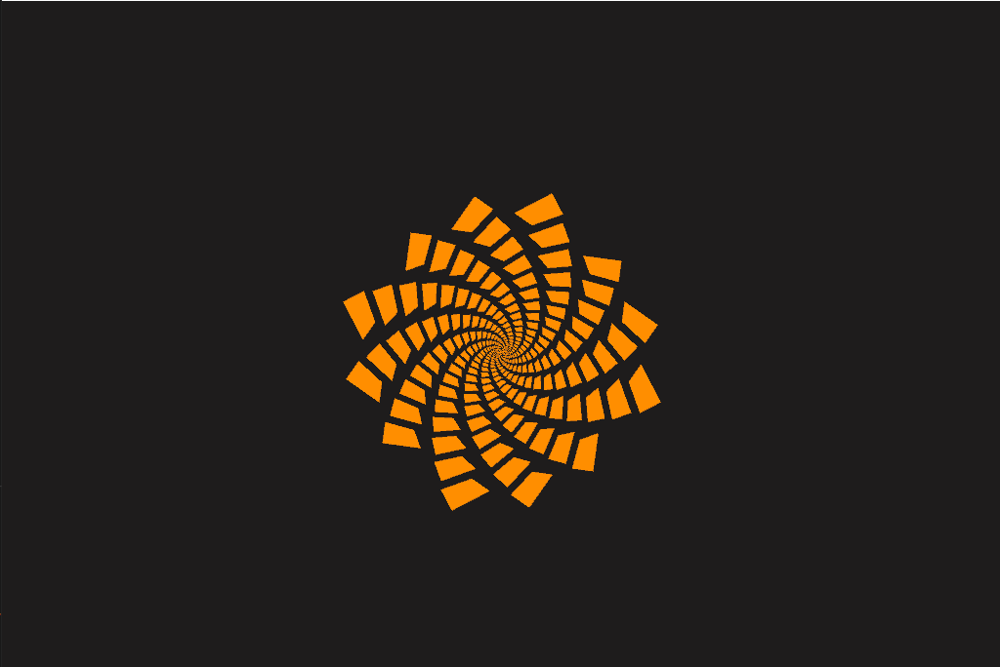
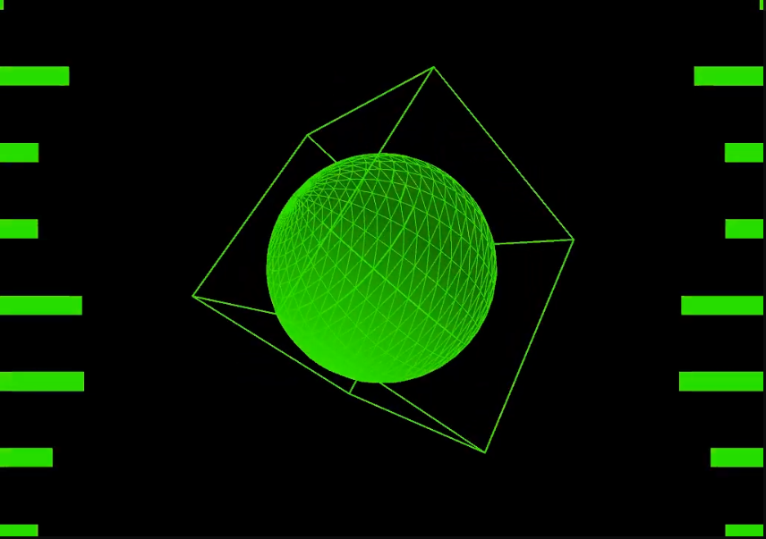
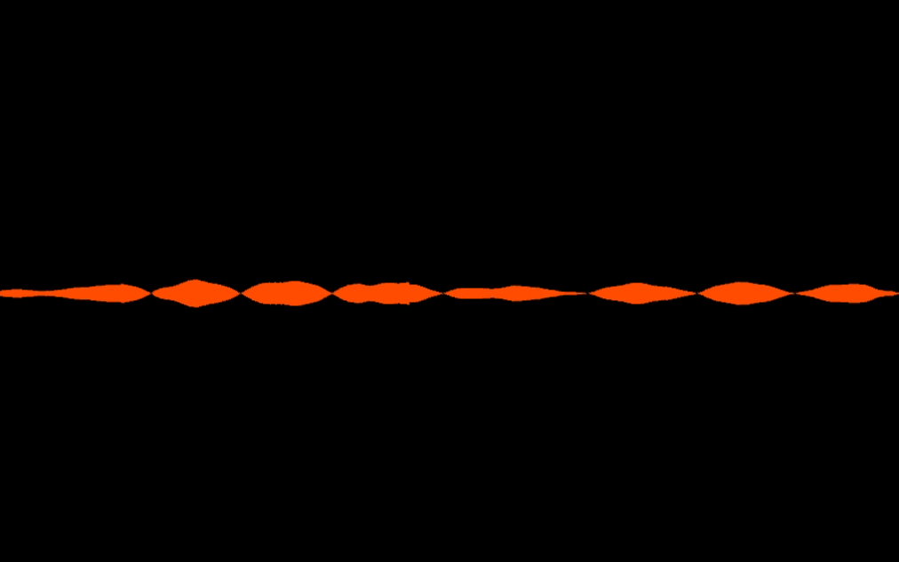
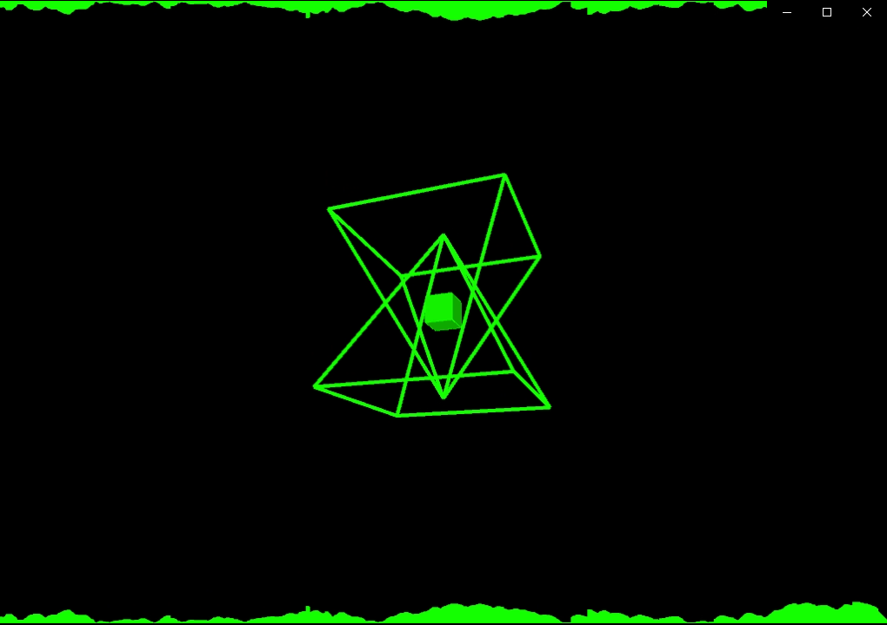
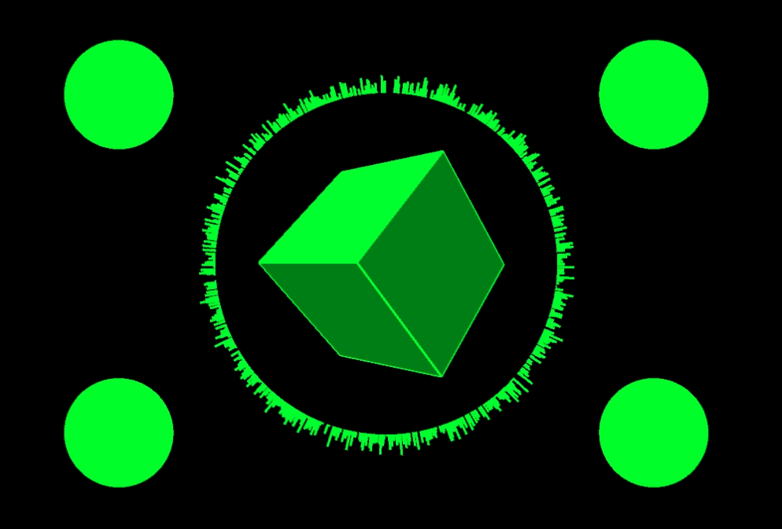
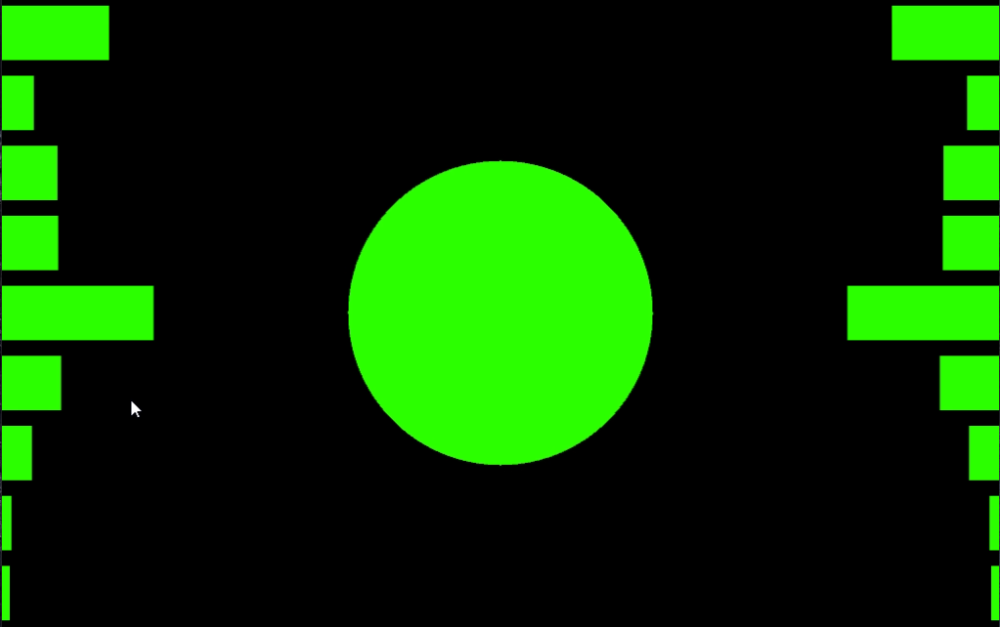

# Music Visualiser Project

Name: Ben McCormack

Student Number: C19459424

# Description of the assignment
"Something beautiful to enjoy while listening to music." was the brief given for this assignment. I wanted to create an interactive experience that the user could get lost in and enjoy whilst listening to music. Many of these visuals are inspired by the early works of ODEZA's early music videos. ODEZSA are two DJs from America who used many geometric visuals in their early music visuals. The song used in this assignment is created by ODEZA and is called "How did I get here". The visuals react to the music by changing colour and size according to the amplitude and frequency of the audio file. Any other audio file can be simply substituted by cloning this repo, adding the audio file to the data folder and changing the name of the file in the loadAudio() function located in the BensVisual file.

# Instructions
- Music is started by pressing the space key
- Visuals can be changed using the numbers  1 to 6 on the keyboard.
- The rotating scaled rectangles (Visual 6) can be scaled by dragging the mouse across the screen.

# How it works
Visual is a PApplet that contains all the signal processing functions and their relevant getters and setters. Since BensVisual extends Visual it also has access to these features.
The visuals themselves are stored in seperate classes and declared within BensVisual. This can be seen in the code below.
```Java
public class BensVisual extends Visual {
    waveform wf;
    rectSize rects;
    freqBars fb;
    cubeVisual cv;
    pyramidVisual pv;
    radialWaveform rw;
    linesCircle lc;
    menu menu;

    ...
}
```
Each class contains a constructor which is used to initialize the objects. BensVisual is a parameter in each constructor, this allows us to use variables from BensVisual within the classes.
```Java
public freqBars(BensVisual bv)
{
    this.bv = bv; 
}
```
The width of BensVisual can now be used within the class with the following code:
```Java
bv.width
```
The classes are instanciated in the setup method as follows:
```Java
 public void setup()
    {
        wf = new waveform(this);
        rects = new rectSize(this);
        fb = new freqBars(this);
        cv = new cubeVisual(this);
        pv = new pyramidVisual(this);
        rw = new radialWaveform(this);
        lc = new linesCircle(this);
        menu = new menu(this);
    }
```

Key presses are read and stored in the which variable. The switch statement will then execute the case relevant to the key press. The code for the switch statement is attached below.
```Java
switch(which)
        {
            case 1:
                wf.render();
                break;

            case 2:
                cv.render();
                break;

            case 3:
                pv.render();
                break;
            
            case 4:
                rw.render();
                break;

            case 5:
                fb.render();
                break;

            case 6:
                rects.render();
                break;

            default:
                menu.render();
                break;
        }
```


# What I am most proud of in the assignment
I am most proud of the rotating illusion I created with the rectangles in *rectSize.java*. I discovered something similar to this online and was inspired to do my own take on something similar. I started by noting features that I liked about the visual and then also make note of my own features that I would like to implement. The features I wanted to implemement included making the rectangles pulse with the music and change colour with the music. Both of these features were accomplished by using the map function which included getSmoothedAmplitude() method as shown below.

```Java
bv.fill(PApplet.map(bv.getSmoothedAmplitude(), 0, 1, 0,255), 255, 255);
bv.stroke(PApplet.map(bv.getSmoothedAmplitude(), 0, 1, 0,255), 255, 255);
```

Scaling the visual with the use of the mouse is another thing that I added to the illusion. Although I liked how it looked initially I began to think of ways to make it more interactive. As the mouse is dragged across the screen, the visual is enlarged which gives the effect that you are now inside the flower like illusion when looking at the screen. The scaling of the visual was done as follows.
```Java
float scaleVar = PApplet.map(bv.mouseX, 0 ,width, (float)0.5,10);
bv.scale(scaleVar);
```
I had to learn a few new things myself throughout this process such as:
 - How to draw a shape from the middle as opposed to the corner as it is drawn by default.
 - How scaling works in processing
 - How to give the effect that shapes were drawn on top of each other when by default you can see the previously drawn shapes stroke through the new one.

I spent quite a few hours trying to figure out how to stop the stroke of a previously drawn shape from showing through the new shape and eventually found the following function in the PApplet class which resolved the issue:
```Java
bv.hint(PConstants.DISABLE_OPTIMIZED_STROKE);
```

The visual then went from looking like this:


To this:


I am really proud of this feature and how the end result turned out. I truly believe that this along with the other elements throughout my program meet the brief requirement of being "Something beautiful to enjoy while listening to music."

Full render method for feature:
```Java
public void render(){
        bv.strokeWeight(20);
        bv.colorMode(PApplet.HSB);
        bv.fill(PApplet.map(bv.getSmoothedAmplitude(), 0, 1, 0,255), 255, 255);
        bv.stroke(0,15,30);
        bv.background(0,15,30);
        bv.translate(width/2, height/2);

        //mouse scaling - draw mouse across x axis of screen to scale visual
        float scaleVar = PApplet.map(bv.mouseX, 0 ,width, (float)0.5,10);
        bv.scale(scaleVar);

        //for loop to draw rectangles
        for(int i = 0; i < 100; i++)
        {
            bv.scale((float)0.95);
            bv.rotate(PApplet.radians(angle));
            bv.rect(0,0,500 + bv.getSmoothedAmplitude() * 200 ,500 + bv.getSmoothedAmplitude() * 200);
        }
        angle += 0.05; //angle is increased
    }
```
# Images of Other Visuals
## Cube Visual

- Cube and sphere contained inside it both react to the music by changing in size.
- Cube and sphere will also change colour as the amplitude changes. 
- Frequency bars on sides of screen change in size depending on the frequency data.
## Waveform Visual

- Waveform drawn to the screen and changes as the values in the audio buffer change.
- Waveform changes colour as the amplitude changes.
## Pyramid Visual

- Cube inside pyramids reacts to the music by changing in colour and in size.
- All elements on the screen will change colour by reacting to the value of smoothedAmplitude()
## Radial Waveform Visual

- Waveform drawn to the screen and changes as the values in the audio buffer change.
- Waveform changes colour as the amplitude changes.
- Circles change colour and give the effect of pulsing to the music by having a value multiplied by the smoothedAmplitude and being added to its predetermined size.
- Cube rotates and reacts to change in amplitude by changing colour and size.
## Frequency Bars Visual

- Frequency bars on sides of screen change in size depending on the frequency data.
- Ellipse in the middle of the screen gives the effect of pulsing to the music by having a value multiplied by the smoothedAmplitude and being added to its predetermined size.
# YouTube Video

[](https://www.youtube.com/watch?v=onMAeF_B1tc)

# Markdown Tutorial

This is *emphasis*

This is a bulleted list

- Item
- Item

This is a numbered list

1. Item
1. Item

This is a [hyperlink](http://bryanduggan.org)

# Headings
## Headings
#### Headings
##### Headings

This is code:

```Java
public void render()
{
	ui.noFill();
	ui.stroke(255);
	ui.rect(x, y, width, height);
	ui.textAlign(PApplet.CENTER, PApplet.CENTER);
	ui.text(text, x + width * 0.5f, y + height * 0.5f);
}
```

So is this without specifying the language:

```
public void render()
{
	ui.noFill();
	ui.stroke(255);
	ui.rect(x, y, width, height);
	ui.textAlign(PApplet.CENTER, PApplet.CENTER);
	ui.text(text, x + width * 0.5f, y + height * 0.5f);
}
```

This is an image using a relative URL:


This is an image using an absolute URL:


This is a youtube video:

[](https://www.youtube.com/watch?v=J2kHSSFA4NU)

This is a table:

| Heading 1 | Heading 2 |
|-----------|-----------|
|Some stuff | Some more stuff in this column |
|Some stuff | Some more stuff in this column |
|Some stuff | Some more stuff in this column |
|Some stuff | Some more stuff in this column |

